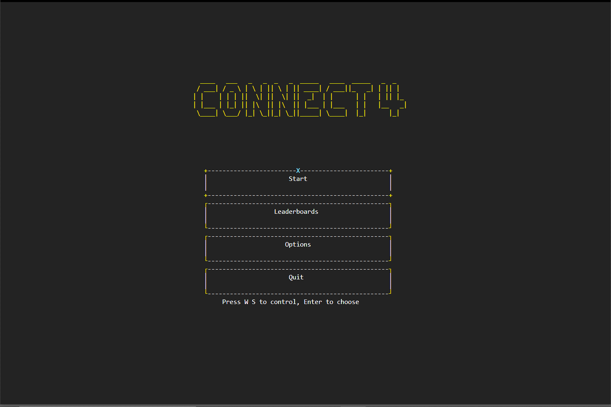

# Connect 4

2019 March Programming Principles Assignment Group 4

| Task | People in charged |
| --- | --- |
| GUI | Chang Cheng (1802 6856),Keanu (1802 0552) |
| Rules | Ke Xin (1710 6097), Wen Li  (1711 3564) |
| AI | Yuen Yuee (1900 0272) |

## Introduction

The following program is modelled after the popular board game &quot;Connect Four&quot;. This variant of the game utilizes the Python language, as well as the curses module to design and recreate the game.

The _features_ of this game are as follows:

1. Colorful graphics

2. Customizable game settings

3. Navigation menu

4. Saving game states

1. Colorful graphics

Via usage of the curses module, menus and game boards are created with colors, which can interact with the player. This is done by initializing color pairs to be used when printing strings or objects in the program.

**Customizable game settings**

Before players start a Connect Four game, they are not only presented with a choice of game difficulty, but they are also able to modify player preferences, such as symbol color, and background music of choice. This allows for a more varied and enticing player experience.

**Navigation menu**

Unlike most variants of the Connect Four game which utilize terminals as well as manual input, this variant presents a Graphical User Interface (GUI) which can be interacted with by the player via the Arrow and Enter keys, allowing for easier navigation between menus.

**Saving game states**

In between each turn between the player and the computer, the program automatically saves the game state and stores the current game board status in a file. This allows players to pause and save games, to be continued at a later time.

As a result, the above features overall enhance the player experience and reduce player inconvenience.

Next, the _major strengths_ of our program are as follows:

1. Easy to navigate

2. Challenging AI

3. Visually appealing

**Easy to navigate**

As stated earlier, the introduction of a navigation menu drastically reduces time spent navigating between game menus and screens, compared to that of a terminal program. This allows players to start the game without wasting any time.

**Challenging AI**

Unlike most variants of the Connect Four game which utilize Python&#39;s randint() function, this variant utilizes the Minimax-alike algorithm to accurately predict upcoming moves by the player, allowing the computer to optimize choices to prevent the player from winning. Overall, this makes the game more challenging and fun to play.

**Visually appealing**

Lastly, the usage of colors and symbols creates a familiar experience pertaining to 8-bit style retro games, and visually attracts the player&#39;s attention. With this, players are more likely to continue playing.

As such, this variant of the Connect Four game has strengths and features which outweigh that of other variants.

(422 words)

## Getting Started

    Double click app.py to launch the program

## Prerequisites

    This program required python 3 version in order to run, 
    if you do not have python 3, please visit to [https://www.python.org](https://www.python.org) 
    to download and install.

## Issues

These are multiple issues found (solved) :

If you are facing &quot;\_curses\_error addwstr() returned ERR&quot;:

    Go to setting - system - Display - change the scale and layout to 125% or below

Python/pip is not in system path:

    Please refer to:  [click me](https://geek-university.com/python/add-python-to-the-windows-path/)

If you had found any new issue, please email to [18026856@imail.sunway.edu.my](mailto:18026856@imail.sunway.edu.my) for further helps.

## Built with

Python Curses ( [https://docs.python.org/2/library/curses.html](https://docs.python.org/2/library/curses.html) ) – A terminal-based GUI framework

## Acknowledgement

- This program is for 2019 Sunway University Programming Principles Assignment uses
- This program is an initial work
- Open source, free to fork

## Contact

Please contact to [18026856@imail.sunway.edu.my](mailto:18026856@imail.sunway.edu.my) or [https://github.com/pupubird](https://github.com/pupubird).